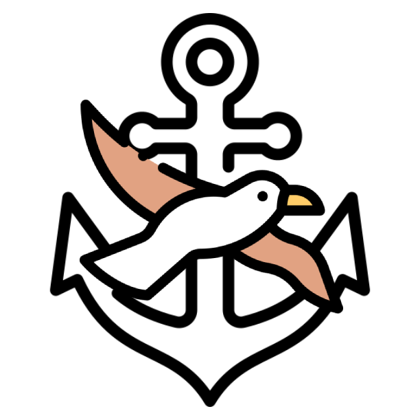
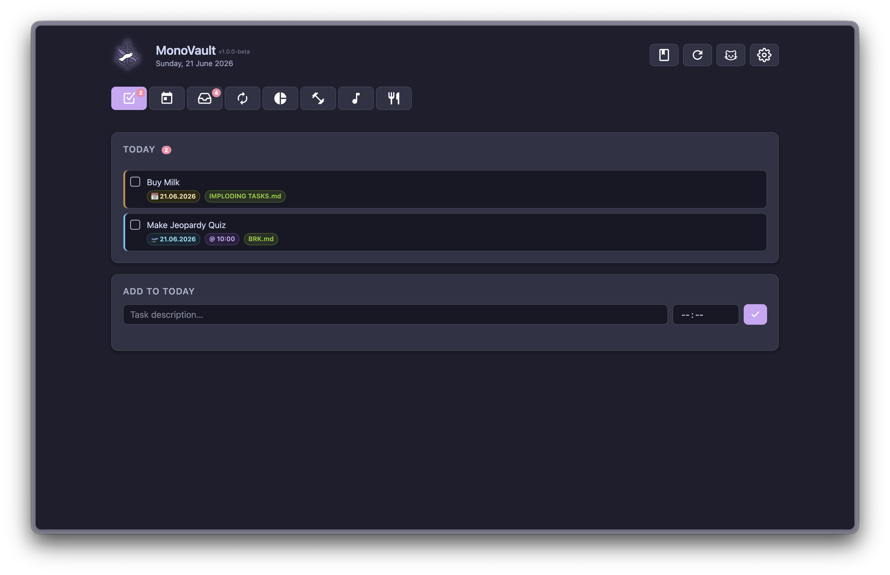
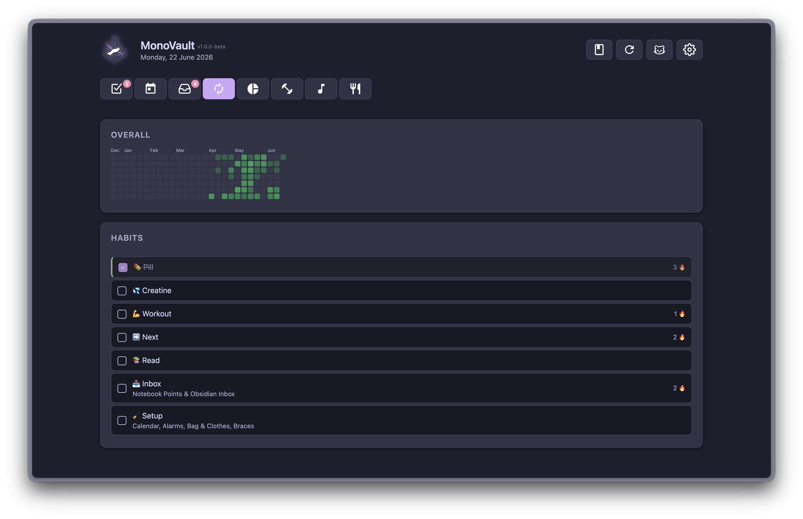
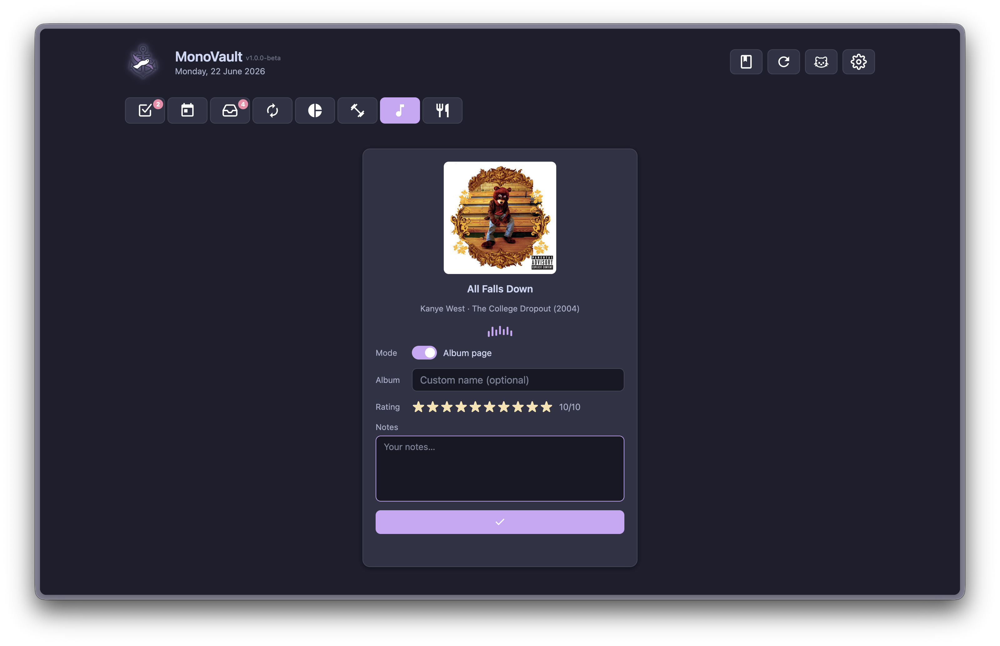

<div align="center">

<!-- Replace with your logo -->


# Albatross

**A personal productivity dashboard for your Obsidian vault**

[](https://www.python.org/)
[](https://nodejs.org/)

</div>

---

## Screenshots

<div align="center">

| Today | Habits | Music |
|:---:|:---:|:---:|
|  |  |  |

</div>

---

## Features

- **Today** — view your daily tasks, complete or reschedule them, and receive time-based push notifications via [Pushover](https://pushover.net/). An iOS [Scriptable](https://scriptable.app/) widget fetches tasks straight to your homescreen.
- **Habits** — track daily habits stored in your vault with streak visibility and one-tap check-ins.
- **Music** — browse your currently-playing Spotify album, write reviews, and save them as Markdown notes directly into your vault.
- **Planning** — manage upcoming tasks and priorities across your vault.
- **Inbox** — triage and route new items captured in your Obsidian inbox.
- **Finance** — track personal finance entries linked to your vault notes.
- **Workout** — log workout sessions and review history from your vault.
- **Food** — log meals and nutrition notes into your vault.

---

## Prerequisites

- [Python 3.10+](https://www.python.org/)
- [Node.js 18+](https://nodejs.org/) and npm
- An [Obsidian](https://obsidian.md/) vault
- A [Pushover](https://pushover.net/) account (API token + user key)
- *(Optional)* A [Spotify Developer](https://developer.spotify.com/) app for the Music tab

---

## Installation

### 1. Clone the repository

```bash
git clone https://github.com/Mono2202/obsidian-tasks-utils.git
cd obsidian-tasks-utils
```

### 2. Install Python dependencies

```bash
pip install flask python-dotenv requests spotipy
```

### 3. Install and build the frontend

```bash
cd frontend
npm install
npm run build
cd ..
```

### 4. Configure environment variables

Copy the example below into a `.env` file at the project root and fill in your values:

```env
PUSHOVER_API_TOKEN=your_api_token
PUSHOVER_USER_KEY=your_user_key
HOST=0.0.0.0
PORT=13371

# Vault root (absolute path)
OBSIDIAN_VAULT_PATH=/absolute/path/to/your/vault

# Vault-relative paths
OBSIDIAN_INBOX_PATH=Areas/GTD/Inbox.md
OBSIDIAN_IMPLODING_TASKS_PATH=Areas/GTD/IMPLODING TASKS.md
OBSIDIAN_HABITS_PATH=Areas/Habits
OBSIDIAN_DAILY_PATH=Journal
OBSIDIAN_ARCHIVE_PATH=Archive

# Optional — Spotify integration
SPOTIFY_CLIENT_ID=your_client_id
SPOTIFY_CLIENT_SECRET=your_client_secret
SPOTIFY_REDIRECT_URI=http://localhost:13371/music/callback
OBSIDIAN_REVIEWS_PATH=Music/Reviews
OBSIDIAN_ASSETS_PATH=Music/Assets
```

See the [Configuration reference](#configuration-reference) section for a full description of each variable.

### 5. Run the app

```bash
python main.py
```

Open [http://localhost:13371](http://localhost:13371) in your browser.

---

## Development

Run the Flask backend and the Vite dev server in parallel for hot module replacement:

```bash
# Terminal 1 — Flask backend
python main.py

# Terminal 2 — Vite dev server
cd frontend && npm run dev
```

Then open [http://localhost:5173](http://localhost:5173). All API requests are proxied to Flask automatically.

After making frontend changes, rebuild before running in production:

```bash
cd frontend && npm run build
```

---

## iOS Widget

`utils/scriptable.js` is a [Scriptable](https://scriptable.app/) script that renders your daily tasks as a homescreen widget. Copy the script into Scriptable, set the server IP to match your machine's local address, and add it as a widget on your iOS homescreen.

---

## Configuration Reference

| Variable | Required | Description |
|---|---|---|
| `PUSHOVER_API_TOKEN` | Yes | API token from your Pushover application |
| `PUSHOVER_USER_KEY` | Yes | Your Pushover user key |
| `HOST` | Yes | Host to bind the Flask server to (e.g. `0.0.0.0`) |
| `PORT` | Yes | Port for the Flask server (e.g. `13371`) |
| `OBSIDIAN_VAULT_PATH` | Yes | Absolute path to the root of your Obsidian vault |
| `OBSIDIAN_INBOX_PATH` | Yes | Vault-relative path to your inbox note |
| `OBSIDIAN_IMPLODING_TASKS_PATH` | Yes | Vault-relative path to your imploding tasks note |
| `OBSIDIAN_HABITS_PATH` | Yes | Vault-relative path to your habits folder |
| `OBSIDIAN_DAILY_PATH` | Yes | Vault-relative path to your daily notes folder |
| `OBSIDIAN_ARCHIVE_PATH` | No | Vault-relative path to your archive folder (excluded from inbox autocomplete) |
| `SPOTIFY_CLIENT_ID` | No | Client ID from your Spotify Developer app |
| `SPOTIFY_CLIENT_SECRET` | No | Client secret from your Spotify Developer app |
| `SPOTIFY_REDIRECT_URI` | No | OAuth redirect URI (must match your Spotify app settings) |
| `OBSIDIAN_REVIEWS_PATH` | No | Vault-relative path where music reviews are saved |
| `OBSIDIAN_ASSETS_PATH` | No | Vault-relative path where album artwork is saved |